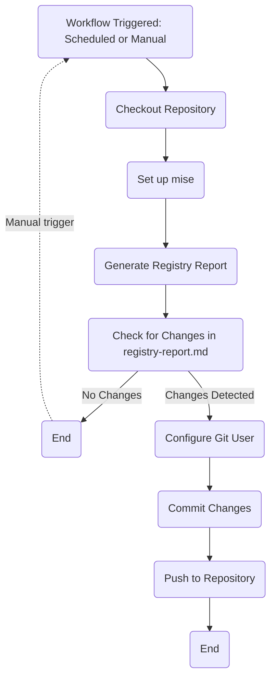

```mermaid
graph TD
    A(Workflow Triggered: Scheduled or Manual) --> B(Checkout Repository)
    B --> C(Set up mise)
    C --> D(Generate Registry Report)
    D --> E(Check for Changes in registry-report.md)
    E -- No Changes --> F(End)
    E -- Changes Detected --> G(Configure Git User)
    G --> H(Commit Changes)
    H --> I(Push to Repository)
    F -.->|Manual trigger| A
    I --> J(End)
```
